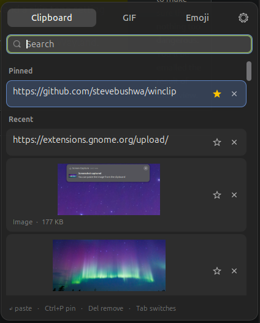
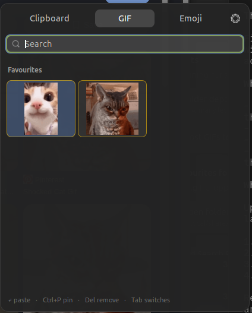
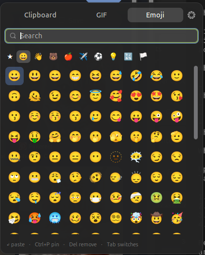

# WinClip

A Windows-style clipboard manager for GNOME Shell on Wayland. `Super+V` opens
an overlay at the pointer, on top of whatever window you are in.

- **Clipboard** — text and image history, with pinned entries kept at the top
- **GIF** — GIFs you have copied, favourites, and animated GIFs found in your
  Downloads and Pictures folders
- **Emoji** — 1,914 emoji searchable by name and keyword, with pins, recents
  and a skin-tone setting

Choosing an entry pastes it straight into the window underneath.

## Screenshots

| Clipboard | GIF | Emoji |
| :---: | :---: | :---: |
|  |  |  |
| Text and images, pinned entries first | Favourites, copied GIFs, and GIFs found on disk | 1,914 emoji, searchable, with pins and recents |

## Why an extension and not an app

Mutter does not implement the wlroots `data-control` protocol, so `wl-paste
--watch` and the standalone clipboard managers built on it cannot observe
clipboard changes under GNOME. Only code running inside the shell can, via
`MetaSelection::owner-changed`. Running in-process also allows the overlay to
be drawn over fullscreen windows and positioned at the pointer, and lets the
paste be synthesised through a Clutter virtual input device rather than
`ydotool` or raw `/dev/uinput` access.

## Requirements

GNOME Shell 50 on Wayland.

## Install

From [extensions.gnome.org](https://extensions.gnome.org), or from source:

```sh
make install
```

Then log out and back in — GNOME only scans for new extensions at startup.

## Keys

| Key | Action |
| --- | --- |
| `Super+V` | open / close |
| type | search the current tab |
| `↑ ↓ ← →` | move between entries |
| `Enter` | paste the selection |
| `Tab` / `Shift+Tab` | switch tab |
| `Ctrl+P` | pin / unpin |
| `Delete` | remove from history |
| `Esc` | close |

Arrow keys navigate while the search box is empty. Once you have typed
something, `←` and `→` edit the text and `Ctrl+←` / `Ctrl+→` navigate.

## Files

| Path | Contents |
| --- | --- |
| `~/.local/share/winclip/store.json` | history index |
| `~/.local/share/winclip/blobs/` | copied images, content-addressed |
| `~/.local/share/winclip/gifs/` | GIF favourites — drop `.gif` files here |

`store.json` holds whatever you have copied. It is created mode `600`, but
treat it as sensitive.

## Settings

- **Paste on selection** — turn off to only place the entry on the clipboard.
  If an app misses the paste, raise the paste delay.
- **Prefer text over image** — office suites advertise a picture alongside
  rich text; on (the default) those stay text, while screenshots and
  "Copy Image" still arrive as images.
- **History** — entry cap plus a total disk budget for stored images, since a
  hundred screenshots at the per-image limit would otherwise be gigabytes.
- **GIFs** — which folders to scan, how deep, how many results to list, and
  how a GIF is placed on the clipboard.

### Pasting GIFs

GNOME publishes a single clipboard type per copy, and nearly every application
asks for `image/png`. A GIF offered as `image/gif` therefore pastes into almost
nothing. Offering several types at once is not possible from an extension:
`St.Clipboard` takes one type, and owning the selection with a custom
`MetaSelectionSource` fails because GJS cannot implement a vfunc that takes a
callback, which `read_async` does.

So **Copy GIFs as** picks one:

| Setting | Behaviour |
| --- | --- |
| Still image (PNG) — default | First frame, converted. Pastes anywhere; not animated. |
| Animated GIF | Stays animated, but only apps that request `image/gif` see it. |
| The file itself | A `file://` URI. Chat clients and file managers attach the animated file. |

### Online search

Off by default. Turning on Giphy in preferences and entering **your own API
key** adds its results to the GIF tab. No key is bundled — one shipped inside
an open-source extension would be extracted and revoked — so get a free one
from the [Giphy developer portal](https://developers.giphy.com/docs/api/).

Results appear once you **type at least two characters**; the tab does not
call the API just for being opened. Nothing contacts the network until a
provider is selected, a key entered, and something typed. Results are fetched
as small previews; the full-size file is downloaded only when you choose or
pin one, and previews are cached in `~/.local/share/winclip/cache/`, which is
emptied when the extension is disabled.

Tenor is not offered: Google stopped issuing keys on 13 January 2026 and shut
the public API down on 30 June 2026.

Scanning is asynchronous, capped by depth and result count, and cached, so it
does not stall the shell on large folders.

**Animate GIFs** (on by default) controls whether previews move. Each playing
GIF is captured once into a short loop of thumbnail-sized frames and the
decoder is then dropped, so at most six animate at once and whichever the
pointer is over always gets a slot. Across a folder of 68 GIFs that costs
roughly 29 MB; turned off, still frames cost about 18 MB.

WinClip never deletes files it did not create. Unpinning a GIF found on disk
forgets the reference and leaves the file alone.

## Building

```sh
make pack      # dist/winclip@stevebushwa.github.io.shell-extension.zip
make install   # pack, then install locally
```

## Licence

GPL-2.0-or-later. See [LICENSE](LICENSE).
